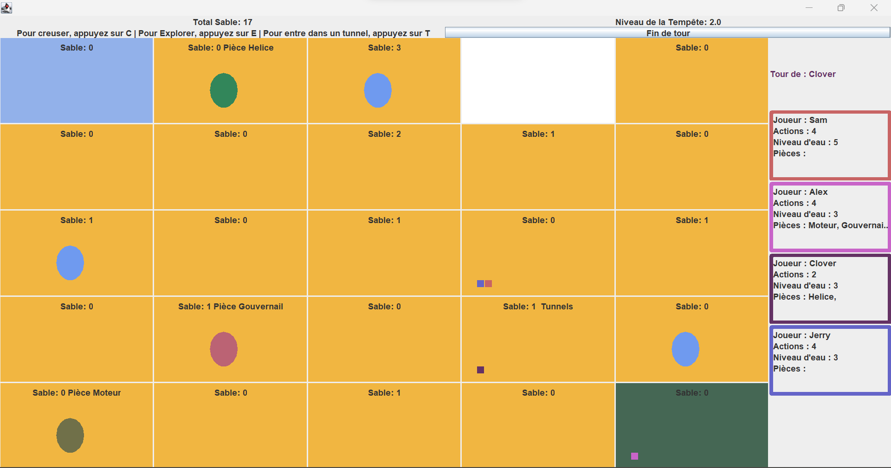

# Projet POGL - Le désert interdit

## Description
Dans ce projet, nous avons réalisé une version simplifiée du jeu Le Desert Interdit.

## Visual
- Au lancement du jeu, cliquer sur le bouton 'Start'.


- Sélectionner le nombre de joueurs à l'aide du curseur puis cliquer sur le bouton Suivant.


- Entrez le nom de vos joueurs un par un et appuyer sur Ok pour valider les noms choisi.


- Voici l'écran de jeu.


    - La grille se trouvant sur la partie gauche et centrale est la vue jeu représentant le désert interdit.
        - La case blanche représente l'œil de la tempête qui peut se déplacer à la fin d'un tour.
        - Les cases bleue et verte représentent respectivement le lieu du crash et la piste de décollage.
        - Toutes les cases (sauf celle de l'œil) indique le niveau de sable se trouvant sur la case
        - Les carrés de différentes couleurs présents sur les cass représentent les joueurs.
          - Chaque joueur a une couleur attribuée au debut de la partie.
        - Les cercles bleus représentent les cases 'Oasis'. En l'explorant, les joueurs présents sur la case pourront récupérer 2 portions d'eau. L'une des cases est un mirage, les joueurs ne récupéreront pas d'eau.
        - Pour Explorer une case, il faut que le joueur dont c'est le tour soit sur la case et appuie sur 'E'.
          - Lorsqu'une case est explorée, elle affiche le nom du type de case. (exemple: Oasis, Mirage, ...)
        - Après exploration, si la case explorée est un tunnel le joueur pourra alors rentrer dans le tunnel en appuyant sur 'T' et sera téléporté sur l'autre case tunnel.
        - Lorsqu'un joueur est sur une case contenant du sable et que c'est son tour, il peut creuser pour enlever 1 tone de sable en appuyant sur 'C'.
        - Les pièces de la machine volante apparaissent également sur les cases une fois celles-ci explorés. 

    - La partie droite est la vue des joueurs. Chaque joueur dispose de son propre panneau et le nom du joueur dont c'est le tour est indiqué.
      - Chaque panneau contient le nom du joueur, le nombre d'actions qu'il lui reste pour le tour en cours, son niveau d'eau et une liste des pièces de la machine qu'il a récupéré.
      - Tous les panneaux ont une bordure de couleur correspondant à la couleur du joueur et donc à la couleur d'un carré présent sur la grille représentant le desert.
      - En haut, le nom du joueur dont c'est le tour est affiché dans la couleur du joueur en question.

    -  La partie haute contient les informations relatives au desert, aux commandes à utiliser et le bouton fin de tour.
       - Les informations relatives au desert sont le niveau total de sable et le niveau de la tempête.
       - Les commandes indiquent aux joueurs les touches du clavier qu'ils peuvent utiliser pour creuser, explorer et rentrer dans un tunnel.
       - Les joueurs peuvent appuyer sur le bouton find de tour pour indiquer que le tour en cours est fini
         - à la fin d'un tour les joueurs dont c'est le tour change et 3 actions du desert peuvent se produire.
           - La vague de chaleur : la vague de chaleur est une action du desert qui force tous les joueurs à boire 2 gorgés d'eau dans leurs gourdes (sauf pour les joueurs se trouvant dans un tunnel).
           - La tempête se déchaîne : lorsque la tempête se déchaîne le niveau de la tempête augmente de 0,5.
           - Le vent souffle : lorsque le vent souffle l'œil se déplace laissant du sable sur les cases où il passe.

## Commentaire
Nous souhaitons préciser qu'au début du projet nous étions un peu perdues et nous avions du mal à démarrer, nous nous sommes donc inspirées de l'organisation et de l'implémentation du code dans le fichier jar qui nous était fournis (notamment pour certaines parties des vues).

Par ailleurs, nous avons suivi l'architecture Vue-Contrôle-Modèle et nous avons donc créé des packages pour contenir les classes appartenant à chaque partie de cette architecture.

## Execution
```bash
cd src
javac *.java Contrôleurs/*.java Modèles/Case.java Modèles/Coordonnées.java Modèles/Desert.java Modèles/Joueurs.java Vues/*.java
java Jeu
```

## Contributing
No contribution

## Authors 
DUFLOS Inès et ERNEZ Meriam (2023)

## Project status
Development finished
